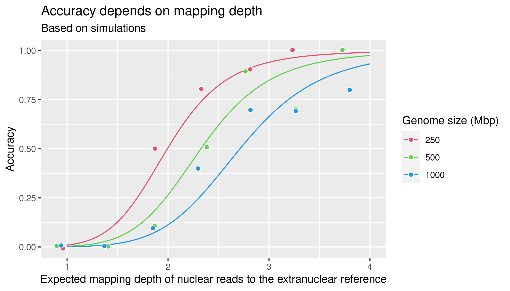
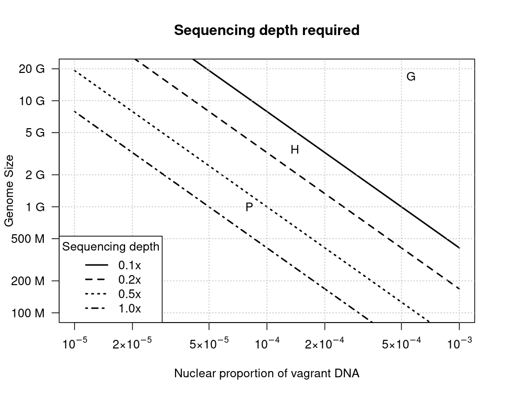

# vagrantDnaSim

Pipeline to simulate vagrant DNA insertion in to nuclear genomes.

## Setup
1. Clone the repository
2. Set up a conda environment: `conda create -n vagrantSim -c bioconda -c conda-forge bwa-mem2 "r-base>=4" r-matrix wgsim samtools freebayes scikit-allel zarr`

## Runing the pipeline
1. Activate conda environment: `conda activate vagrantSim` or `source activate vagrantSim`
2. Run pipeline, for instance: `bash 00pipeline.sh 250M000 250000000 0.00004`. The parameters are: [outname] [nuclear genome size] [insertion rate per year]

## Output format
The most imortant output is `[outname].log`, a three-line text file. Example:
```
0.001274594                                     # Observed proportion of vagrant DNA inserts in this simulation run
0.001496896 0.001103315 0.002030592 0.001515834 # intercept estimate, lower 95%-CI, upper 95%-CI, mapping-depth estimate
YES, contained                                  # Whether or not the actual value is within the CI
```
Multiple of these output files can be summarised doing `grep contained *log > grepOut`. Here is an example (also see folder `exampleOut`):
```
001G000.log:YES, contained
001G001.log:YES, contained
001G002.log:YES, contained
001G003.log:YES, contained
001G004.log:YES, contained
001G006.log:YES, contained
001G007.log:YES, contained
001G008.log:NOT contained
```
These data can then be analysed. An example is given in file `15evaluateSimsExample.R`, see also the graph in section "Summary of results" below.

## What the pipeline does
1. In R
  * Generates an empty nuclear genome of defined size (sparse array to save memory).
  * Genetates a random extranuclear sequence of 16000nt length
  * Cylces through 15,000,000 years, checking each year if a substitution happens in the extranuclear DNA and is an insertion happens into the nuclear genome. 
  * Genomes are written out. The nuclear one is made up randomly while on the fly, filling in vagrant inserts that were recorded during the 15M years.
2. Sequencing reads are simulated using [wgsim](https://github.com/lh3/wgsim)
3. Reads are mapped using [bwa-mem2](https://github.com/bwa-mem2/bwa-mem2)
4. BAM files are sorted and indexed with samtools. Variants are called using freebayes.
5. VCF is converted to allele count tables using [scikit-allel](https://scikit-allel.readthedocs.io/en/stable/) in Python
6. Numbers of mapped and total basairs in the data are recorded
7. Allele count tables are converted into the input data format required for fitting. 
8. The fit is run.
9. Results are stored in `[outname].log`

## Summary of results
Plot generated with `15evaluateSimsExample.R`


The associated coefficient table is:
```
             Estimate Std. Error z value Pr(>|z|)    
(Intercept)    3.6314     2.4267   1.496 0.134543    
log(GSinMbp)  -1.5034     0.4217  -3.565 0.000364 ***
log(numtDep)   6.7679     0.9332   7.252 4.11e-13 ***
```
## Depth required

